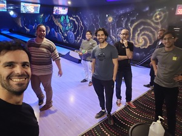

## Solutions IA : Durables et Sur Mesure
Nous offrons une gamme complète de services en Intelligence Artificielle, y compris le développement de stratégies IA, la vision par ordinateur, 
la science des données, les MLOps, les pipelines de données, le traitement du langage naturel, et la recherche opérationnelle.

[Parlez avec nous](https://meetings.hubspot.com/keven-moreau/rencontrer-updata)

Members:
- [@maorzalt](https://github.com/maorzalt)
- [@kevenmoreau](https://github.com/kevenmoreau)
- [@afroserom](https://github.com/afroserom)
- [@henrisve](https://github.com/henrisve)
- [@ianbenlolo](https://github.com/ianbenlolo)
- [@Jef808](https://github.com/Jef808)
- [@Davidnet](https://github.com/Davidnet)

<!--

**Here are some ideas to get you started:**

🙋‍♀️ A short introduction - what is your organization all about?
🌈 Contribution guidelines - how can the community get involved?
👩‍💻 Useful resources - where can the community find your docs? Is there anything else the community should know?
🍿 Fun facts - what does your team eat for breakfast?
🧙 Remember, you can do mighty things with the power of [Markdown](https://docs.github.com/github/writing-on-github/getting-started-with-writing-and-formatting-on-github/basic-writing-and-formatting-syntax)
-->
